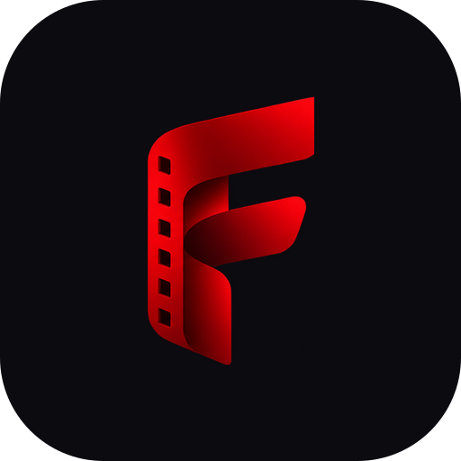
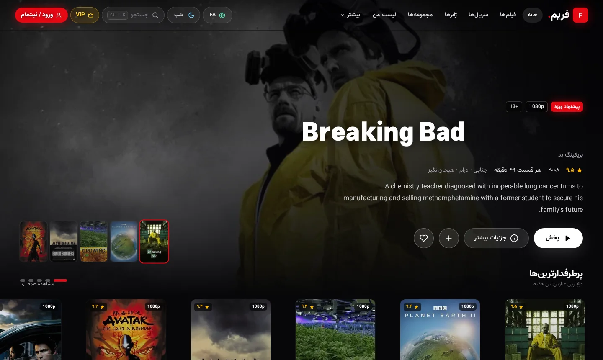
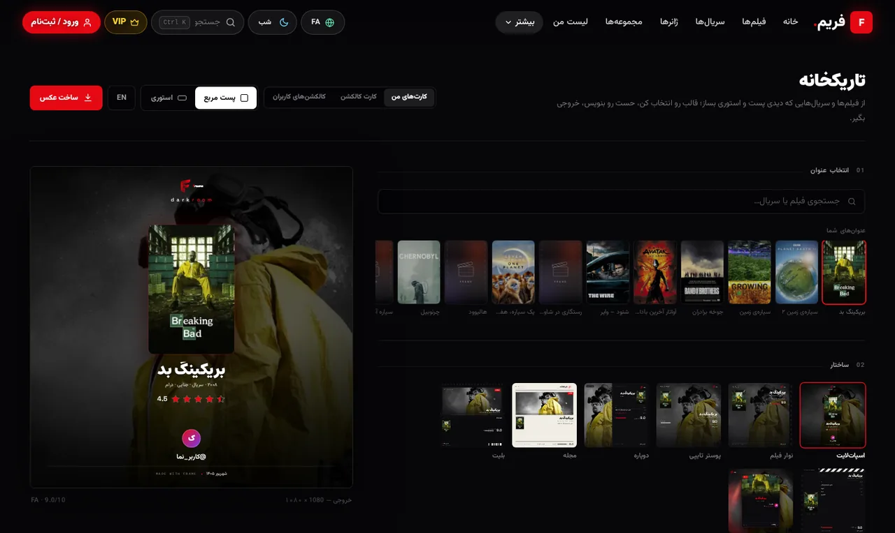
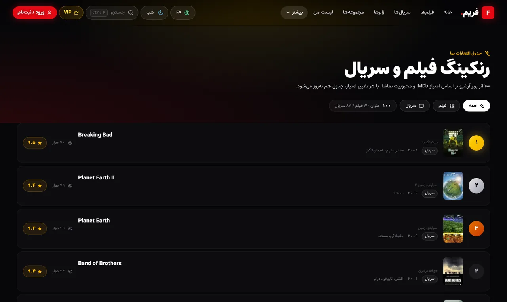
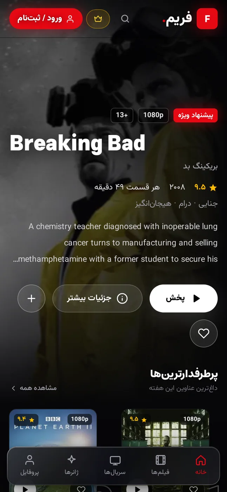

  

<h1 align="center">فریم — سینمای خانگی 🎬</h1>

  <b>هزاران فیلم و سریال با کیفیت تا 4K، دوبله و زیرنویس فارسی — روی ویندوز، مک، لینوکس و اندروید.</b> 
  لیست تماشا، کلکسیون‌سازی، تاریک‌خانه و همگام‌سازی ابری؛ همه در یک برنامه‌ی زیبا و کاملاً فارسی.

  
  
  
  
  

---

## 📸 نگاهی به فریم

| خانه (دسکتاپ) | تاریک‌خانه — ساخت کارت اشتراک |
|:---:|:---:|
|  |  |

| رنک‌بندی‌ها | نسخه‌ی اندروید |
|:---:|:---:|
|  |  |

## ✨ امکانات

- 🎬 **کتابخانه‌ی بزرگ** — بیش از **۱۸ هزار فیلم** و **۳٬۸۰۰ سریال**؛ جستجوی زنده، فیلتر ژانر و سال و رنک‌بندی‌های به‌روز بر اساس IMDb.
- ▶️ **پخش‌کننده‌ی حرفه‌ای** — ادامه‌ی تماشا از همان ثانیه، پرش ±۱۰ ثانیه، انتخاب کیفیت تا 4K و رفتن خودکار به قسمت بعد.
- 🗣 **دوبله و زیرنویس فارسی** — نسخه‌های دوبله با نشان مشخص می‌شوند؛ زیرنویس فارسی با فونت و اندازه‌ی قابل تنظیم.
- ❤️ **لیست من** — علاقه‌مندی‌ها، لیست تماشا، وضعیت تماشا و امتیازدهی شخصی.
- ⭐ **کلکسیون‌سازی** — ساخت مجموعه با قالب‌های آماده، در چند ثانیه.
- 📷 **تاریک‌خانه** — پوستر حرفه‌ای اشتراک‌گذاری (استوری/پست) از فیلم‌ها و کلکسیون‌های موردعلاقه‌ات.
- ☁️ **همگام‌سازی ابری** — لیست، امتیازها، کلکسیون‌ها، تاریخچه و ادامه‌ی تماشا بین گوشی و کامپیوتر.
- 📥 **دانلود و تماشای آفلاین** (اندروید) — با توقف/ادامه‌ی دانلود و پخش‌کننده‌ی بومی (ExoPlayer) برای MKV/HEVC.
- 🔄 **به‌روزرسانی خودکار** — دسکتاپ دلتای کم‌حجم دانلود می‌کند؛ اندروید بیشتر نسخه‌ها را «درجا» و بی‌صدا نصب می‌کند.

## ⬇️ دانلود

> 🌐 صفحه‌ی معرفی کامل با لینک‌های مستقیم و راهنما: **[pvwvuow.github.io/frame](https://pvwvuow.github.io/frame/)**

آخرین نسخه همیشه در [**Releases**](https://github.com/pvwvuow/frame/releases/latest) موجود است:

| پلتفرم | فایل |
|---|---|
| 🪟 ویندوز ۱۰/۱۱ | `Frame-<نسخه>-win-x64-setup.exe` (نصبی) یا `...-portable.exe` (بدون نصب) |
| 🍎 مک (Apple Silicon / Intel) | `Frame-<نسخه>-mac-arm64.dmg` یا `...-mac-x64.dmg` |
| 🐧 لینوکس | `Frame-<نسخه>-linux-x86_64.AppImage` یا `...-amd64.deb` |
| 🤖 اندروید ۷+ | `Frame-<نسخه>-android.apk` |

> برنامه خودش نسخه‌ی جدید را چک می‌کند و به‌روز می‌شود؛ لازم نیست دنبال آپدیت بگردی.

### 🤖 نصب اندروید

فریم در گوگل‌پلی منتشر نمی‌شود و مستقیم از گیت‌هاب دانلود می‌شود؛ هشدار اندروید برای برنامه‌های خارج از استور طبیعی است و به معنی ویروس **نیست**:

1. فایل `Frame-<نسخه>-android.apk` را از [Releases](https://github.com/pvwvuow/frame/releases/latest) بگیر.
2. اگر پیام «اجازه نصب از این منبع» آمد → **تنظیمات** → اجازه بده.
3. اگر پیام Google Play Protect آمد → **More details** → **Install anyway**.

> فریم هیچ‌وقت رمز، پیامک یا دسترسی به مخاطبین را نمی‌خواهد؛ تنها مجوز لازم: اینترنت.

## 👑 اشتراک VIP

پخش نامحدود همه‌ی عناوین روی همه‌ی پلتفرم‌ها با کد اشتراک — از داخل برنامه در بخش VIP فعال می‌شود (۱/۳/۶ ماهه، ۱ ساله و مادام‌العمر).

## ❓ پرسش‌های پرتکرار

سؤال کامل و پاسخ‌ها در [سایت معرفی — بخش پرسش‌ها](https://pvwvuow.github.io/frame/#faq)؛ خلاصه:

- **فریم رایگان است؟** بله؛ VIP فقط برای پخش نامحدود همه‌ی عناوین است.
- **بدون حساب هم کار می‌کند؟** بله؛ با حساب رایگان همه‌چیز بین دستگاه‌ها همگام می‌شود.
- **داده‌هایم با عوض کردن حساب می‌پرد؟** نه؛ هر حساب فضای جداگانه دارد.
- **آپدیت اندروید چطور است؟** خود برنامه چک می‌کند؛ بیشتر نسخه‌ها درجا و بی‌صدا نصب می‌شوند.

---

### درباره‌ی این مخزن

این مخزن فقط «توزیع عمومی» فریم را میزبانی می‌کند: ریلیزها (نصب‌کننده‌ها، APK اندروید و کاورپک آفلاین)، کاتالوگ عمومی اپ در `public/catalog/` و صفحه‌ی معرفی در `docs/`.
توسعه به‌صورت خصوصی انجام می‌شود و سورس‌کد عمومی نیست. کلاینت‌های نصب‌شده برای بررسی به‌روزرسانی از GitHub Releases API همین مخزن استفاده می‌کنند و بدون هیچ تنظیمی کار می‌کنند.

*Frame — home cinema app for Windows, macOS, Linux & Android. Thousands of movies & series with Persian subtitles and dubbing, up to 4K.*

