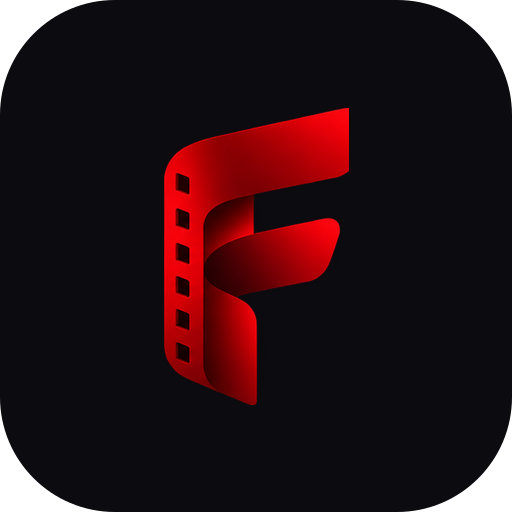
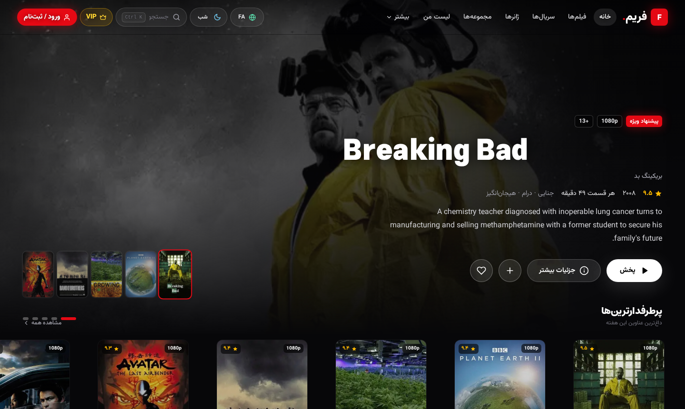
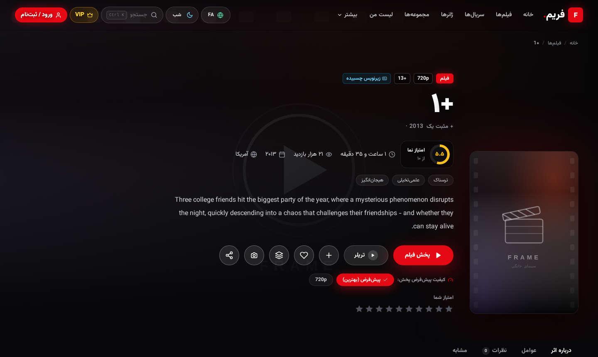
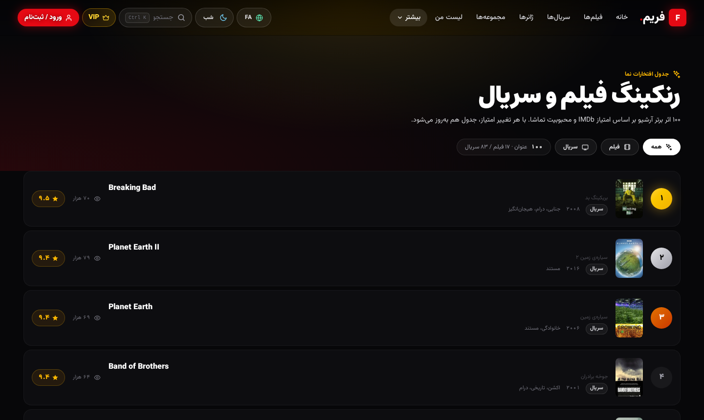
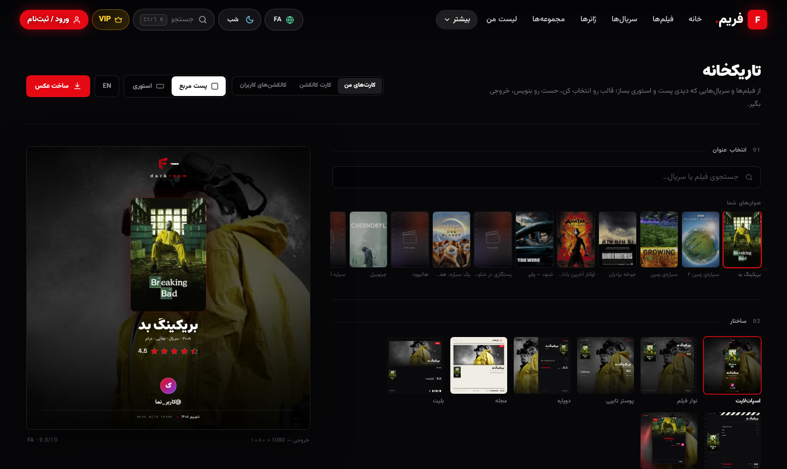
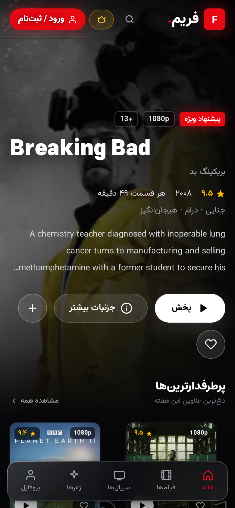
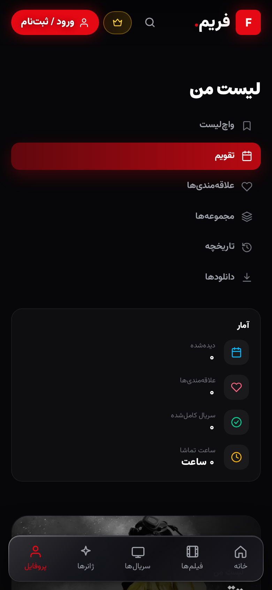

<div dir="rtl">

<p align="center">
  
</p>

<h1 align="center">فریم — سینمای خانگی</h1>

<p align="center">
  <b>هزاران فیلم و سریال با کیفیت تا 4K، دوبله و زیرنویس فارسی — روی ویندوز، مک، لینوکس و اندروید.</b><br/>
  آرشیو شخصی، لیست تماشا، کلکسیون‌سازی، کارت‌های اشتراک‌گذاری و همگام‌سازی ابری؛ همه در یک برنامه‌ی زیبا و کاملاً فارسی.
</p>

<p align="center">
  <a href="https://github.com/pvwvuow/frame/actions/workflows/desktop.yml"></a>
  <a href="https://github.com/pvwvuow/frame/actions/workflows/ci.yml"></a>
  
  
  
</p>

---

## 📸 نگاهی به فریم

| خانه (دسکتاپ) | صفحه‌ی فیلم |
|:---:|:---:|
|  |  |

| رنک‌بندی‌ها | تاریک‌خانه (ساخت کارت اشتراک‌گذاری) |
|:---:|:---:|
|  |  |

| موبایل — خانه | موبایل — لیست من |
|:---:|:---:|
|  |  |

---

## ✨ امکانات

### 🎬 تماشا
- **کتابخانه‌ی بزرگ** با هزاران فیلم و سریال؛ جستجوی زنده، فیلتر ژانر/سال/امتیاز و رنک‌بندی‌های به‌روز.
- **پخش‌کننده‌ی اختصاصی** با ادامه‌ی تماشای خودکار، پرش ±۱۰ ثانیه، زیرنویس فارسی قابل تنظیم، انتخاب کیفیت و بخش بعدی خودکار برای سریال‌ها.
- **دوبله و زیرنویس چسبیده** — نسخه‌های موجود هر عنوان با نشان مشخص می‌شود.
- **ادامه‌ی تماشا** در همان ثانیه‌ای که رها کردید، روی همه‌ی دستگاه‌ها.

### 📚 شخصی‌سازی
- **لیست من** — علاقه‌مندی‌ها، لیست تماشا، وضعیت تماشا و امتیازدهی شخصی.
- **کلکسیون‌های کاربری** — هر چند عنوان که دوست دارید را در یک مجموعه جمع کنید؛ با **قالب‌های آماده** (ترسناک برای شب، شاهکارهای سینما و…) در چند ثانیه بسازید.
- **همگام‌سازی کامل ابری** — با ورود به حساب، همه‌چیز بین گوشی و کامپیوتر جابه‌جا می‌شود: علاقه‌مندی‌ها، لیست تماشا، امتیازها، کلکسیون‌ها، **تاریخچه و ادامه‌ی تماشا** و حتی **نام، آواتار و تنظیمات** حساب.
- **جداسازی کامل حساب‌ها** — هر حساب روی یک دستگاه، فضای مخصوص خودش را دارد؛ با جابه‌جایی حساب، داده‌های حساب قبلی جایی نمی‌روند.

### 📷 تاریک‌خانه
- **کارت‌های فیلم** — برای فیلم موردعلاقه‌تان نظر بنویسید و از آن یک **پوستر حرفه‌ای اشتراک‌گذاری** (استوری/پست) بسازید.
- **کارت کلکسیون** — از هر کلکسیون خودتان، با **۶ قالب آماده**، تصویر خروجی بگیرید و در شبکه‌های اجتماعی به اشتراک بگذارید.
- **دیوار کلکسیون‌ها** — کلکسیون‌های عمومی کاربران دیگر را ببینید و با یک لمس به کلکسیون‌های خودتان اضافه کنید.

### 👑 اشتراک VIP
- فعال‌سازی با کد؛ پخش نامحدود همه‌ی عناوین در همه‌ی پلتفرم‌ها.

### 📱 تجربه‌ی اندروید بومی‌شده (تازه در `0.12.0`)
- **پخش‌کننده‌ی بومی (ExoPlayer)** — فیلم‌های MKV/HEVC که در نسخه‌های قبلی اصلاً پخش نمی‌شدند، حالا با **زیرنویس فارسی داخل فایل** به‌صورت بومی پخش می‌شوند.
- **دانلود و تماشای آفلاین** — هر فیلم یا قسمت را روی گوشی ذخیره کنید (با توقف/ادامه و سرعت) و بدون اینترنت تماشا کنید؛ از صفحه‌ی «دانلودها» مدیریت می‌شود.
- **به‌روزرسانی درون‌برنامه‌ای** — بیشتر نسخه‌ها به‌صورت «به‌روزرسانی درجا» نصب می‌شوند؛ فقط تغییرات جدید دانلود می‌شود و **نیازی به نصب مجدد نیست**. اگر تغییرات سیستمی باشد، APK مستقیم در اختیارتان گذاشته می‌شود.
- **نوار پایین هوشمند** — با اسکرول به پایین پنهان و با اسکرول به بالا برمی‌گردد.
- **اسپلش مینیمال** و پنجره‌ی فیلم بدون نوار اسکرول.

### 📱 تجربه‌ی اندروید (`0.11.0`)
- **دکمه‌ی بازگشت سخت‌افزاری** درست کار می‌کند: اول پنجره‌ی باز بسته می‌شود، بعد به صفحه‌ی قبل برمی‌گردد.
- نوار پیمایش پایین شناور، دکمه‌های لمسی روی پوسترها (قلب ❤️ و پخش ▶️)، و پنجره‌های تمام‌صفحه‌ی موبایل‌محور.
- صفحه‌ی **هنرمندان** با جستجوی زنده و بارگذاری تدریجی — سبک و روان روی گوشی.
- پشتیبانی کامل از **ناحیه‌ی امن** (نوار وضعیت و ژست‌های صفحه) در گوشی‌های مدرن.
- آیکون‌های پوشش برای همه‌ی عناوین — دیگر هیچ کاشی «تصویر شکسته» وجود ندارد.

---

## ⬇️ دانلود

آخرین نسخه همیشه در [**Releases**](https://github.com/pvwvuow/frame/releases/latest) موجود است:

| پلتفرم | فایل |
|---|---|
| 🪟 ویندوز 10/11 | `Frame-<نسخه>-setup.exe` (نصبی) یا `...-portable.exe` (بدون نصب) |
| 🍎 مک (Apple Silicon) | `Frame-<نسخه>-arm64.dmg` |
| 🍎 مک (اینتل) | `Frame-<نسخه>-x64.dmg` |
| 🐧 لینوکس | `Frame-<نسخه>.AppImage` یا `...-.deb` |
| 🤖 اندروید 7+ | `Frame-<نسخه>-android.apk` |

> به‌روزرسانی خودکار: نسخه‌ی دسکتاپ خودش نسخه‌ی جدید را (دلتای کم‌حجم) دانلود و نصب می‌کند. در اندروید، کارت «به‌روزرسانی برنامه» در تنظیمات نسخه‌ی جدید را پیدا و APK را مستقیم می‌دهد.

## 🚀 شروع سریع

1. **نصب** — فایل مخصوص پلتفرمتان را از Releases بگیرید و نصب کنید.
2. **حساب بسازید** — با ایمیل ثبت‌نام کنید تا لیست، کلکسیون‌ها و پیشرفت تماشای شما **روی حساب** بماند و بین دستگاه‌ها همگام شود. (بدون حساب هم می‌توانید تماشا کنید؛ فقط داده‌ها روی همان دستگاه می‌مانند.)
3. **تماشا کنید** — از خانه شروع کنید، یا با جستجو/ژانرها دنبال فیلم بگردید؛ دکمه‌ی ❤️ روی هر پوستر آن را به علاقه‌مندی‌ها می‌گذارد.
4. **VIP** — برای پخش نامحدود، کد اشتراک را در بخش [VIP](https://github.com/pvwvuow/frame/releases/latest) فعال کنید.

### راهنمای استفاده در یک نگاه

| می‌خواهم… | کجا؟ |
|---|---|
| فیلم بگردم | ذره‌بین بالای صفحه (یا `Ctrl+K` در دسکتاپ) |
| چیزی را برای بعد ذخیره کنم | دکمه‌ی ➕ روی هر فیلم → «لیست تماشا» |
| مجموعه‌ی خودم بسازم | **لیست من → مجموعه‌ی جدید** (یا قالب آماده در صفحه‌ی کلکسیون‌ها) |
| برای یک فیلم کارت اشتراک بسازم | **تاریک‌خانه → کارت‌های من** |
| از کلکسیونم عکس بسازم | **تاریک‌خانه → کارت کلکسیون** |
| زیرنویس/کیفیت عوض کنم | داخل پخش‌کننده، دکمه‌ی تنظیمات |
| حساب را عوض کنم | آواتار بالا → خروج، سپس ورود با حساب جدید (داده‌ها قاطی نمی‌شوند) |

## 🔢 نسخه‌گذاری

عدد نسخه‌ها معنادار است و از روی محتوای تغییرات تعیین می‌شود (**semver**):

- `PATCH` (0.0.**x**) — فقط رفع اشکال
- `MINOR` (0.**x**.0) — قابلیت یا تجربه‌ی جدید
- `MAJOR` (**x**.0.0) — تغییرات بزرگ و ناسازگار

جزئیات و تاریخچه: [VERSIONING.md](VERSIONING.md)

## ❓ پرسش‌های پرتکرار

**اولین به‌روزرسانی، کل برنامه را از اول دانلود کرد؛ اشکال دارد؟**
خیر. به‌روزرسانی‌های دلتایی از نسخه‌ی دوم به بعد فعال می‌شوند (نیاز به کشِ نسخه‌ی قبلی دارند). بعد از همین نسخه، آپدیت‌ها سبک و جزئی هستند.

**چرا بعضی پوسترها یک کاشی تیره با نام فیلم دارند؟**
پوستر آن عنوان در نسخه‌ی اندروید (به‌خاطر حجم APK) جای‌گذاری نشده؛ به‌جای کاشی خالی، یک پوستر جایگزین با **نام خود فیلم** می‌بینید.

**چرا بعضی فیلم‌ها در نسخه‌های قبلی گوشی پخش نمی‌شدند؟**
آن عناوین MKV بودند که مرورگر داخل اپ نمی‌فهمد؛ از `0.12.0` پخش‌کننده‌ی بومی (ExoPlayer) آن‌ها را با زیرنویس فارسی پخش می‌کند.

**داده‌هایم با عوض کردن حساب می‌پرد؟**
نه. هر حساب فضای جداگانه دارد و با ورود دوباره، دقیقاً همان داده‌های قبلی برمی‌گردد.

**آپدیت اندروید چطور انجام می‌شود؟**
فریم خودش چک می‌کند. بیشتر نسخه‌ها **درجا** به‌روز می‌شوند — فقط تغییرات دانلود و بدون نصب مجدد اعمال می‌شود. اگر نسخه شامل تغییرات سیستمی باشد، APK برایتان دانلود و پنجره‌ی نصب باز می‌شود. دکمه‌ی دستی هم در **تنظیمات ← به‌روزرسانی برنامه** هست.

## 🛠 ساخته شده با چه چیزی؟

Next.js 16 (React 19) · TypeScript · TailwindCSS 4 · Prisma + SQLite · Electron · Capacitor 8 (اندروید) · Dexie (حالت آفلاین اندروید) · Supabase (سینک ابری)

برای توسعه‌دهنده‌ها: راه‌اندازی از سورس —

```bash
npm install          # prisma generate خودکار اجرا می‌شود
npx prisma db push   # ساخت db/custom.db
npm run dev          # http://localhost:3000
```

| دستور | کار |
|---|---|
| `npm run build` | بیلد دسکتاپ (standalone) |
| `npm run electron:dev` | اجرای پوسته‌ی الکترون روی سرور توسعه |
| `npm run android:apk` | خروجی استاتیک + سینک کاپسیتور + بیلد APK |
| `npm run verify` | تست‌های preflight و پخش |

## 📄 مجوز

تمام حقوق برای تیم فریم محفوظ است. توزیع برنامه از طریق Releases رسمی این مخزن انجام می‌شود.

<p align="center"><sub>فریم — سینمای خانگی · ساخته‌شده با ❤️ برای سینمادوست‌های فارسی‌زبان</sub></p>

</div>

---

<div dir="ltr">

### Frame — home cinema (English summary)

**Frame** is a Persian streaming app for Windows, macOS, Linux and Android: thousands of movies & series up to 4K with Persian subtitles/dubs, a custom player with resume, personal library (favorites, watchlist, ratings), user collections with cloud sync, and a "Darkroom" that turns your reviews and collections into beautiful shareable images.

- **Downloads:** see [Releases](https://github.com/pvwvuow/frame/releases/latest) — Windows setup/portable, macOS dmg (x64/arm64), Linux AppImage/deb, signed Android APK.
- **Accounts:** your library syncs across devices; each account on a shared device gets a fully isolated data space.
- **Versioning:** semantic versioning — see [VERSIONING.md](VERSIONING.md). UI is Persian-first with a full English mode.

</div>
